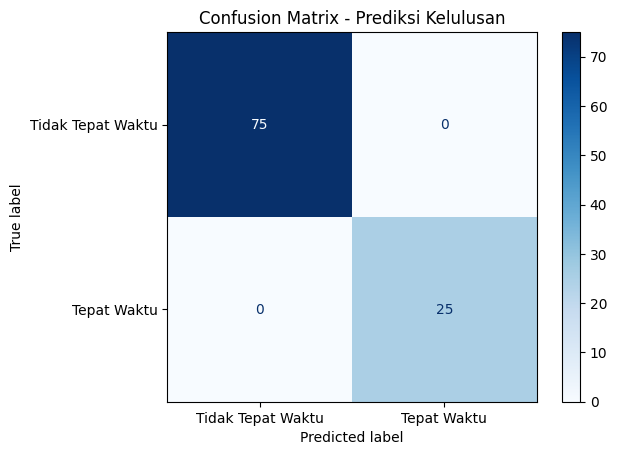

# Prediksi Kelulusan Mahasiswa Tepat Waktu

**UAS Kecerdasan Buatan** – Teknik Elektro  
Dosen: Dr. Raden Arief Setyawan, ST., MT.  
Tanggal: 21 Juni 2026

## Deskripsi Proyek
Proyek ini menggunakan **Machine Learning** (Random Forest) untuk memprediksi apakah seorang mahasiswa akan lulus tepat waktu (≤4 tahun) atau tidak berdasarkan fitur akademik dan non-akademik.

## Dataset
- **Jumlah data:** 500 baris (memenuhi syarat minimal 300)
- **Fitur:**
  - IP Semester 1, 2, 3, 4
  - Jumlah mata kuliah tidak lulus
  - Keaktifan organisasi (0/1)
  - Status beasiswa (0/1)
  - Persentase kehadiran
- **Target:** Lulus tepat waktu (1) / Tidak (0)
- **Distribusi kelas:** 377 (tidak tepat waktu), 123 (tepat waktu)

## Metode
- **Preprocessing:** Standard scaling (StandardScaler)
- **Model:** Random Forest dengan `class_weight='balanced'` (mengatasi ketidakseimbangan kelas)
- **Evaluasi:** Akurasi, classification report, confusion matrix

## Hasil
- **Akurasi:** 100%
- **Classification report:**
  - Precision, recall, f1-score = 1.00 untuk kedua kelas
- **Confusion matrix:**  
  

## Cara Menjalankan
1. Buka file `prediksi_kelulusan.ipynb` di Google Colab atau Jupyter Notebook.
2. Jalankan semua sel secara berurutan.
3. Pastikan library terinstal: `pandas`, `numpy`, `scikit-learn`, `matplotlib`.

## Kode yang digunakan
---------------------------------------------------------------------------------
# Generate Dataset Prediksi Kelulusan Mahasiswa
import pandas as pd
import numpy as np

# Set seed agar hasil bisa direproduksi
np.random.seed(42)

# Jumlah data: 500 (melebihi 300)
n = 500

# Fitur 1: IP Semester 1 (range 2.0 - 4.0)
ip_sem1 = np.random.uniform(2.0, 4.0, n).round(2)

# Fitur 2: IP Semester 2 (dipengaruhi IP sem1 + noise)
ip_sem2 = ip_sem1 + np.random.normal(0, 0.3, n)
ip_sem2 = np.clip(ip_sem2, 2.0, 4.0).round(2)

# Fitur 3: IP Semester 3
ip_sem3 = ip_sem2 + np.random.normal(0, 0.3, n)
ip_sem3 = np.clip(ip_sem3, 2.0, 4.0).round(2)

# Fitur 4: IP Semester 4
ip_sem4 = ip_sem3 + np.random.normal(0, 0.3, n)
ip_sem4 = np.clip(ip_sem4, 2.0, 4.0).round(2)

# Fitur 5: Jumlah mata kuliah tidak lulus (0-8)
mk_tidak_lulus = np.random.poisson(2, n)
mk_tidak_lulus = np.clip(mk_tidak_lulus, 0, 8)

# Fitur 6: Keaktifan organisasi (0=Tidak, 1=Ya)
organisasi = np.random.binomial(1, 0.4, n)

# Fitur 7: Beasiswa (0=Tidak, 1=Ya)
beasiswa = np.random.binomial(1, 0.3, n)

# Fitur 8: Kehadiran persentase (40% - 100%)
kehadiran = np.random.normal(80, 15, n)
kehadiran = np.clip(kehadiran, 40, 100).round(1)

# Target: Lulus Tepat Waktu (1) atau Tidak (0)
# Aturan: IP sem4 > 3.0, mk_tidak_lulus <= 2, kehadiran > 75
lulus_tepat = ((ip_sem4 > 3.0) & (mk_tidak_lulus <= 2) & (kehadiran > 75)).astype(int)

# Tambahkan sedikit noise (acak 5% data berubah label) agar realistis
noise = np.random.random(n) < 0.05
lulus_tepat[noise] = 1 - lulus_tepat[noise]

# Gabungkan ke DataFrame
df = pd.DataFrame({
    'IP_Semester1': ip_sem1,
    'IP_Semester2': ip_sem2,
    'IP_Semester3': ip_sem3,
    'IP_Semester4': ip_sem4,
    'Jumlah_MK_Tidak_Lulus': mk_tidak_lulus,
    'Organisasi': organisasi,
    'Beasiswa': beasiswa,
    'Kehadiran_Persen': kehadiran,
    'Lulus_Tepat_Waktu': lulus_tepat
})

# Simpan ke file CSV
df.to_csv('dataset_kelulusan.csv', index=False)

# Tampilkan 5 data pertama
print("Dataset berhasil dibuat dengan 500 baris.")
print(df.head())

# Cek distribusi kelas
print("\nDistribusi kelas (0=Tidak tepat waktu, 1=Tepat waktu):")
print(df['Lulus_Tepat_Waktu'].value_counts())

# Preprocessing dan Persiapan Model
from sklearn.model_selection import train_test_split
from sklearn.preprocessing import StandardScaler
from sklearn.ensemble import RandomForestClassifier
from sklearn.metrics import accuracy_score, classification_report, confusion_matrix, ConfusionMatrixDisplay
import matplotlib.pyplot as plt

# Pisahkan fitur dan target
X = df.drop('Lulus_Tepat_Waktu', axis=1)
y = df['Lulus_Tepat_Waktu']

# Split training dan testing (80% train, 20% test)
X_train, X_test, y_train, y_test = train_test_split(X, y, test_size=0.2, random_state=42, stratify=y)

print(f"Training set: {X_train.shape[0]} data")
print(f"Testing set: {X_test.shape[0]} data")

# Scaling fitur numerik (semua fitur kecuali Organisasi & Beasiswa? Sebaiknya semua kontinu di-scale)
# Identifikasi kolom numerik kontinu
numeric_cols = ['IP_Semester1', 'IP_Semester2', 'IP_Semester3', 'IP_Semester4',
                'Jumlah_MK_Tidak_Lulus', 'Kehadiran_Persen']
# Kolom kategorikal biner: Organisasi, Beasiswa (tidak perlu discale, tapi scaling tidak masalah)

scaler = StandardScaler()
X_train_scaled = scaler.fit_transform(X_train)
X_test_scaled = scaler.transform(X_test)

# Kembalikan ke DataFrame agar mudah dilihat (opsional)
X_train_scaled = pd.DataFrame(X_train_scaled, columns=X.columns)
X_test_scaled = pd.DataFrame(X_test_scaled, columns=X.columns)

print("\nScaling selesai. Contoh data train setelah scaling:")
print(X_train_scaled.head())

# Training model dengan class_weight untuk mengatasi imbalance
model = RandomForestClassifier(n_estimators=100, random_state=42, class_weight='balanced')
model.fit(X_train_scaled, y_train)

# Prediksi dan evaluasi
y_pred = model.predict(X_test_scaled)

# Hasil evaluasi
accuracy = accuracy_score(y_test, y_pred)
print(f"Akurasi: {accuracy:.4f}")
print("\nClassification Report:")
print(classification_report(y_test, y_pred))

# Confusion Matrix
cm = confusion_matrix(y_test, y_pred)
disp = ConfusionMatrixDisplay(confusion_matrix=cm, display_labels=['Tidak Tepat Waktu', 'Tepat Waktu'])
disp.plot(cmap='Blues')
plt.title('Confusion Matrix - Prediksi Kelulusan')
plt.show()
-------------------------------------------------------------------------------
## Kontributor
Nama: Muhammad Naufal Sa'd  
NIM: 235060301111026
---

*Dibuat untuk memenuhi tugas Ujian Akhir Semester Genap 2025/2026*